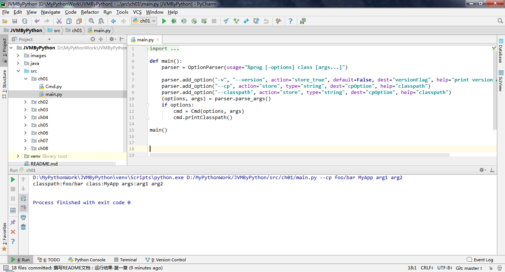
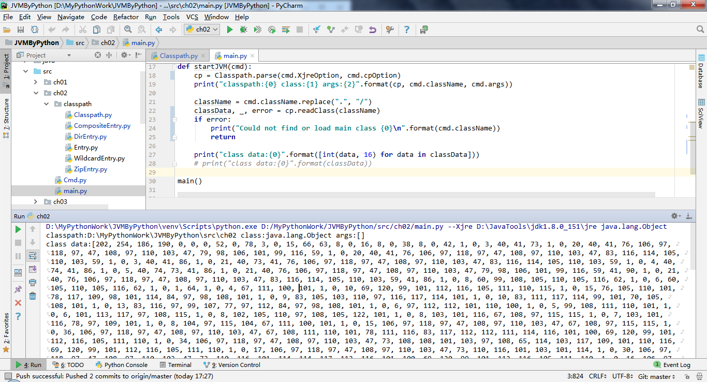
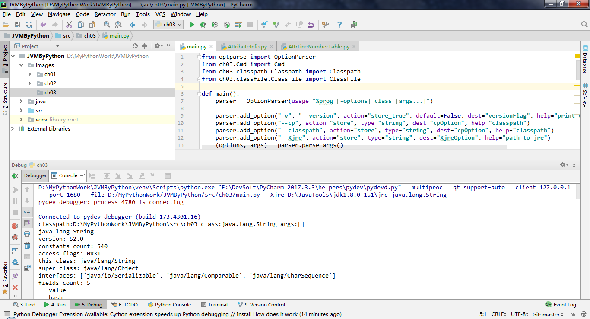
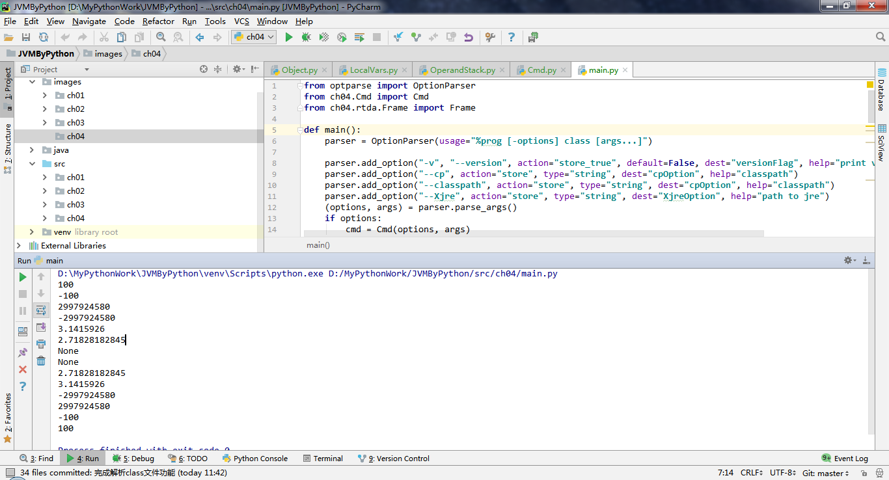

# 记录自己用Python完成编写JVM的过程

项目完全参考张秀宏大神的《自己动手写Java虚拟机》代码结构，在此向本书作者表示感谢。

## 运行环境
Python 版本：3.7.2  
PyCharm 版本：PyCharm 2018.3.7 (Professional Edition)  
Java版本：1.8

## 代码结构

## 代码编写与运行结果
项目的所有运行都是采用直接运行Main.py的方式，请读者运行时注意。

### 第一章-命令行工具
完成一个简易的命令行工具，使用各种参数执行JVM命令  
传入参数：
> --cp foo/bar MyApp arg1 arg2

1. 采用OptionParser作为命令行解析器，具体处理的打印输入留给Cmd类去处理。
2. 用于在使用命令行解析器时，必须使用"--X"表示参数，不能按照书中的"-"进行编码。

### 第二章-搜索class文件
完成搜索class文件功能，类路径的查找，按照搜索的先后顺序，类路径可以从以下3个部分查找：启动类路径、扩展类路径、用户类路径。
传入参数：
> --Xjre "D:\JavaTools\jdk1.8.0_151\jre" java.lang.Object

1. pathListSeparator引用路径写死为分号“;”，Linux下面为冒号。
2. 由于class是Python的关键字，所有代码中的class改为了class_name。
3. 如果该结构体是数组，由于Python无法表示结构数组，故类初始化的时候初始一个数组。

### 第三章-解析class文件
完成解析class文件功能，将class文件加载之后，按照JVM规范，读取字节，存储class的版本号，类属性、方法、接口的对象。  
传入参数：  
> --Xjre "D:\JavaTools\jdk1.8.0_151\jre" java.lang.String

1. 采用property注解，将一些方法设置为属性，以方便对象属性调用；
2. 对于一些要使用len()函数的对象，添加了相关的内置函数__len__()实现。  

### 第四章-运行时数据区
&emsp;&emsp;实现运行时数据区（run-time data area），可分为两类：一类是多线程共享的，另一类是线程私有的。多线程共享的运行时数据区需要在Java虚拟机启动时创建好，在Java虚拟机退出时销毁。线程私有的运行时数据区则在创建线程时才创建，线程退出时销毁。  
&emsp;&emsp;多现场共享的内存区域主要存放两类数据：类数据和类实例（也就是对象）。对象数据存放在堆中，类数据存放在方法区中。线程私有的运行时数据区用于辅助执行Java字节码。  

