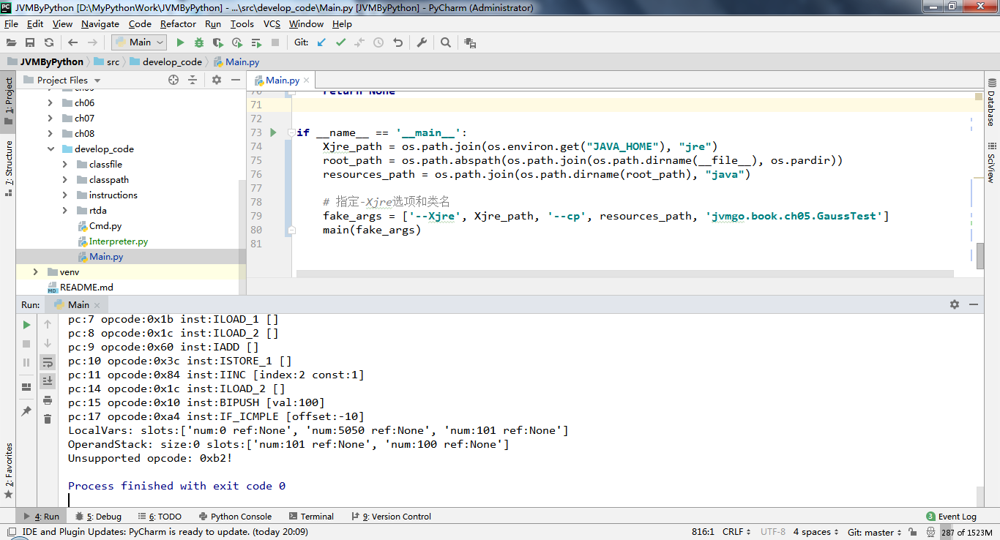
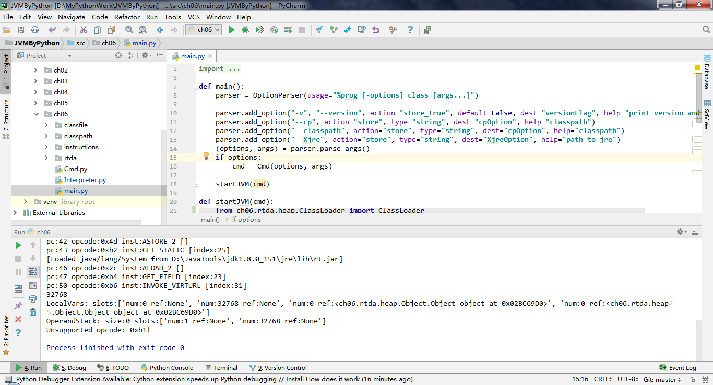
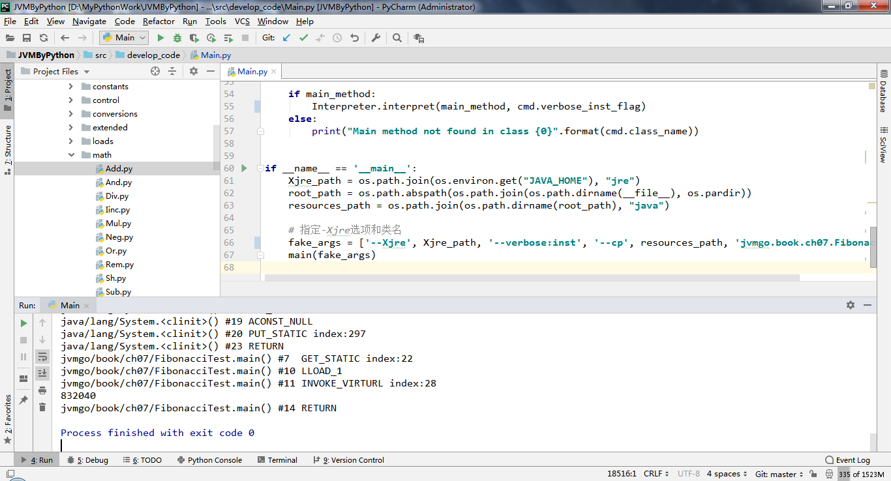
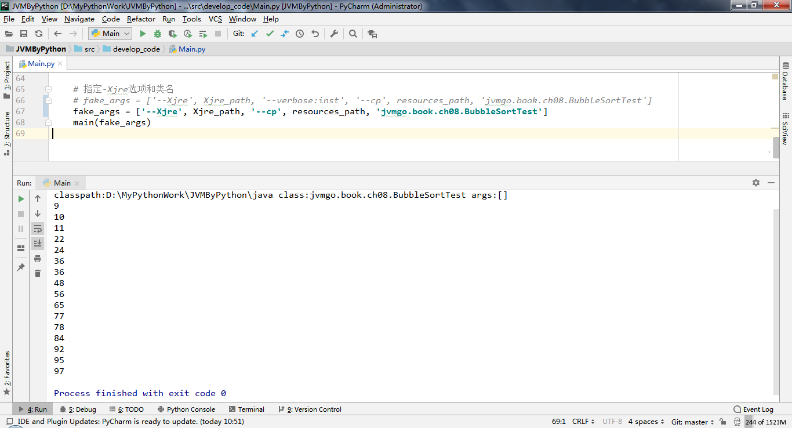
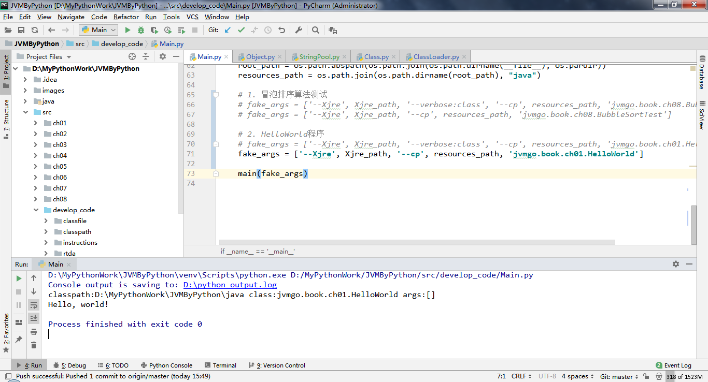
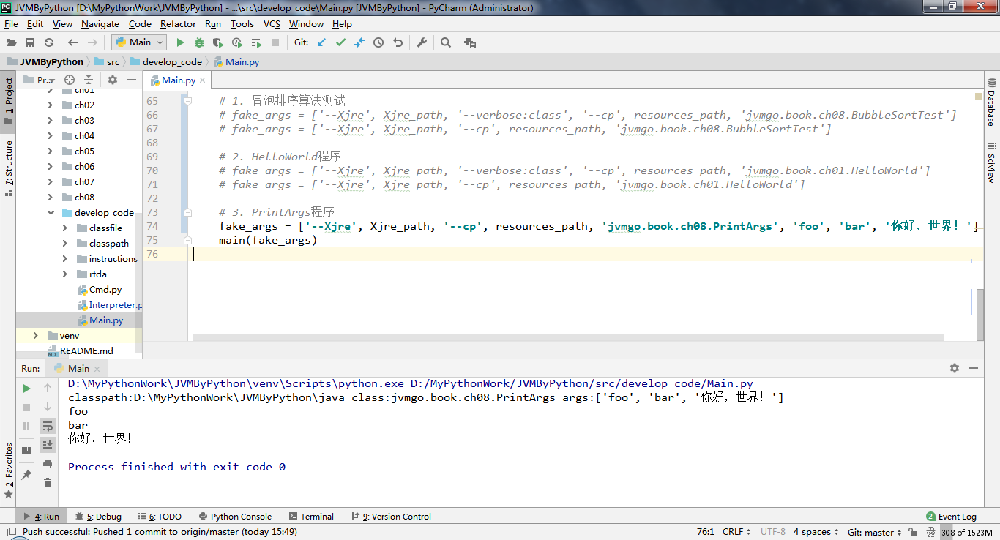
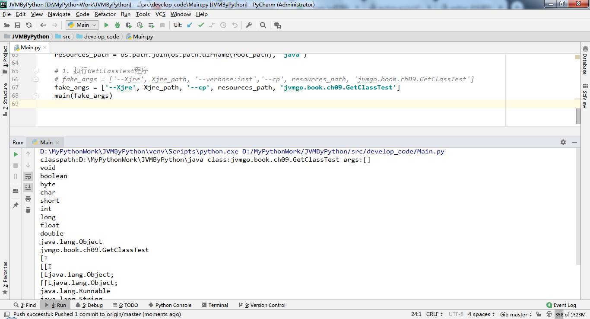
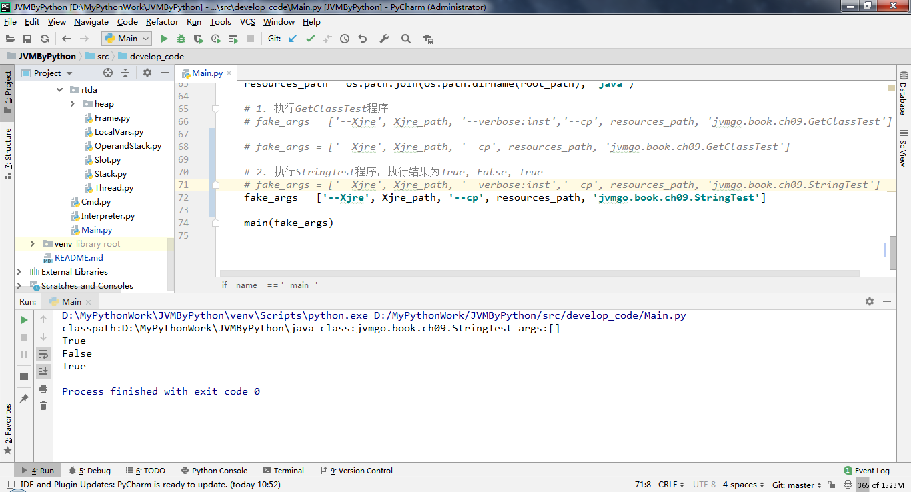
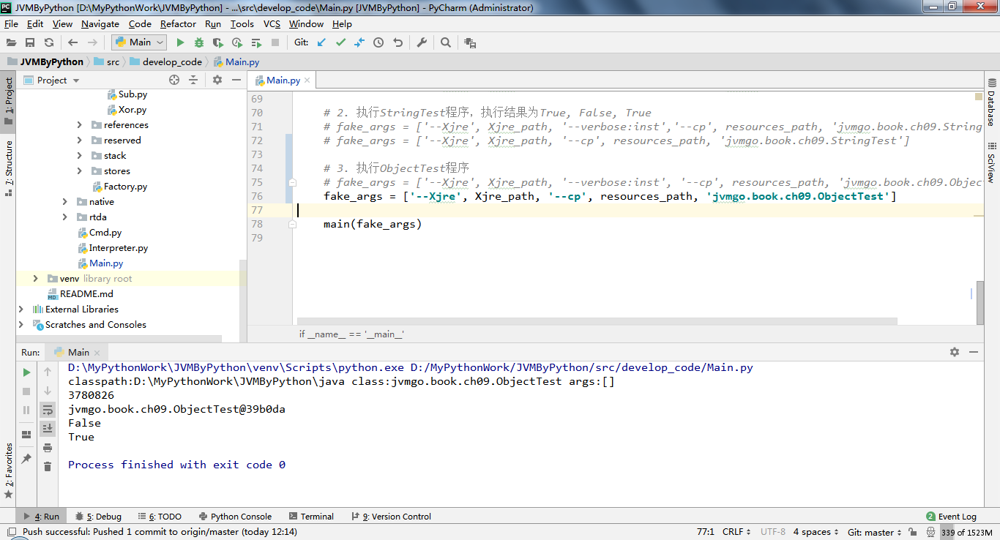

# 记录自己用Python完成编写JVM的过程

项目完全参考张秀宏大神的《自己动手写Java虚拟机》代码结构，在此向本书作者表示感谢。

## 运行环境
Python 版本：3.7.2  
PyCharm 版本：PyCharm 2018.3.7 (Professional Edition)  
Java版本：1.8

## 代码结构

## 代码编写与运行结果
项目的所有运行都是采用直接运行Main.py的方式，请读者运行时注意。

### 第1章-命令行工具
完成一个简易的命令行工具，使用各种参数执行JVM命令  
传入参数：
> --cp foo/bar MyApp arg1 arg2

1. 采用OptionParser作为命令行解析器，具体处理的打印输入留给Cmd类去处理。
2. 在使用命令行解析器时，必须使用"--X"表示参数，不能按照书中的"-"进行编码。

### 第2章-搜索class文件
完成搜索class文件功能，类路径的查找，按照搜索的先后顺序，类路径可以从以下3个部分查找：启动类路径、扩展类路径、用户类路径。
传入参数：
> --Xjre "D:\JavaTools\jdk1.8.0_151\jre" java.lang.Object

1. pathListSeparator引用路径写死为分号“;”，Linux下面为冒号。
2. 由于class是Python的关键字，所有代码中的class改为了class_name。
3. 如果该结构体是数组，由于Python无法表示结构数组，故类初始化的时候初始一个数组。

### 第3章-解析class文件
完成解析class文件功能，将class文件加载之后，按照JVM规范，读取字节，存储class的版本号，类属性、方法、接口的对象。  
传入参数：  
> --Xjre "D:\JavaTools\jdk1.8.0_151\jre" java.lang.String

1. 采用property注解，将一些方法设置为属性，以方便对象属性调用；
2. 对于一些要使用len()函数的对象，添加了相关的内置函数__len__()实现。  

### 第4章-运行时数据区
&emsp;&emsp;实现运行时数据区（run-time data area），可分为两类：一类是多线程共享的，另一类是线程私有的。多线程共享的运行时数据区需要在Java虚拟机启动时创建好，在Java虚拟机退出时销毁。线程私有的运行时数据区则在创建线程时才创建，线程退出时销毁。  
&emsp;&emsp;多现场共享的内存区域主要存放两类数据：类数据和类实例（也就是对象）。对象数据存放在堆中，类数据存放在方法区中。线程私有的运行时数据区用于辅助执行Java字节码。  

### 第5章-指令集和解释器
&emsp;&emsp;在前两章的基础上编写了一个简单的解释器，并实现大约150条指令，可以执行100个整数求和的程序，能得到5050的正确答案。  

### 第6章-类和对象
&emsp;&emsp;实现线程共享的运行时数据区，包括方法区、运行时常量池、类和对象、一个简单的类加载器，以及ldc和部分引用类指令。  

### 第7章-方法调用和返回
&emsp;&emsp;基本完成了方法调用和返回，并实现了类初始化逻辑，已经可以运行Fibonacci程序（求第30个Fibonacci数）。  

1. 程序需要运行好长时间，毕竟采用的是递归
2. 目前有3个todo没有处理，其中没有采用深拷贝，不知道之后的程序会有什么问题。

### 第8章-数组和字符串
实现了数组和字符串的加载，终于可以运行HelloWorld程序了。
1. 解析并执行BubbleSortTest（冒泡排序）算法

2. 解析并执行HelloWorld程序，打印出Hello world!

3. 解析并执行PrintArgs程序，打印出传入的参数

**本章总结：**  
1. 排查了冒泡排序算法执行时的问题，由于DUP指令的实现问题，之前采用的是slot的深拷贝，导致在对象引用置空的时候，不能将slot里的引用同时置空，解决方法：自己实现了一个copy_slot方法，创建一个Slot对象将num和ref都进行复制即可。
2. 在测试HelloWorld程序时，解析java.lang.CharSequence类报错，最后查看到是由于ConstantMethodHandleInfo类中的read_info读取问题导致的。

### 第9章-本地方法调用
实现了本地方法调用的指令，以及Java类库中一些最基本的类和本地方法，有如下本地方法：java.lang.Object.getClass()、java.lang.Class.getPrimitiveClass()、java.lang.Class.getName0()、java.lang.Class.desiredAssertionStatues0、System.arrayCopy()、Float.floatToRawIntBits()、Double.doubleToRawLongBits()  
1. 执行GetClassTest程序，得到基本数据类型的类getName()结果。

2. 执行StringTest程序，得到字符串判断的结果

3. 执行ObjectTest程序，得到对象的hashCode值

**本章总结：**  
1. 由于invokenative指令是动态执行本地方法，又因为本地方法在不同的模块里，因此自己实现了动态加载模块，并执行对应的函数方法。
2. 在doubleToRawLongBits本地方法中处理大数值超长的bits转换采用了如下代码：  
    > s = struct.pack('>q', ctypes.c_uint64(bits).value)  
    value = struct.unpack('>d', s)[0]

